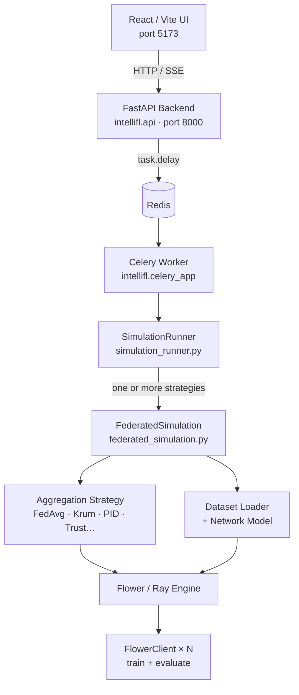

# Architecture

## Component overview



---

## Key modules

### `intellifl/simulation_runner.py`

The top-level entry point. Accepts a JSON config file and:

1. Loads the strategy config via `ConfigLoader`
2. Creates a `DirectoryHandler` to manage output directories
3. Acquires a `SimulationLock` (prevents concurrent hardware contention)
4. Iterates through every strategy in the config, creating a `FederatedSimulation` for each
5. Saves CSVs and plots after each strategy completes

It also handles graceful shutdown on `SIGINT`/`SIGTERM` and Ray cleanup between strategies.

### `intellifl/federated_simulation.py` — `FederatedSimulation`

Orchestrates a single strategy run:

- Selects the correct **dataset loader** and **network model** based on `dataset_keyword`
- Selects the correct **aggregation strategy** based on `aggregation_strategy_keyword`
- Wraps the strategy and clients in Flower's `ServerApp` / `ClientApp` and calls `run_simulation()`
- After the run, optionally generates attack snapshot HTML reports

### `intellifl/client_models/flower_client.py` — `FlowerClient`

Standard Flower `NumPyClient` subclass. Each virtual client:

- Receives global model parameters from the server
- Runs local training for `num_of_client_epochs` epochs
- Optionally applies attacks from the `attack_schedule` before returning updates
- Reports loss and accuracy back to the server

### `intellifl/simulation_strategies/`

Each file implements one aggregation strategy as a Flower `Strategy` subclass. Common fields are shared via `common_kwargs` in `FederatedSimulation._assign_aggregation_strategy()`.

### `intellifl/api/`

FastAPI application with routers for:

| Router | Purpose |
|---|---|
| `simulations` | List, inspect, launch, stop, rename, delete simulations; stream status and logs via SSE |
| `queue` | Get aggregate queue status counts |
| `visualizations` | Fetch plot data JSON and attack snapshot metadata |
| `datasets` | Validate HuggingFace datasets |
| `system` | Health check, device and GPU info |
| `terminal` | Interactive PTY terminal over WebSocket |
| `assistant` | AI agent chat endpoint |

### `intellifl/utils/status_tracker.py` — `StatusTracker`

Writes a `status.json` file into the simulation output directory. Transitions: `queued → pending → running → completed / failed / stopped`. The UI polls this file (and the SSE stream) to display live progress.

---

## Data flow for a simulation

```mermaid
flowchart TD
    S1["1. Config JSON parsed by ConfigLoader"]
    S2["2. StrategyConfig validated by Pydantic"]
    S3["3. DatasetHandler partitions dataset → N client shards"]
    S4["4. FederatedSimulation initialises loaders,<br/>model, strategy, and Flower apps"]
    S5["5. run_simulation() launches Ray actors"]
    Round["For each round<br/>a&#41; Server sends global params<br/>b&#41; Clients train locally<br/>c&#41; Clients apply attack (opt.)<br/>d&#41; Strategy aggregates updates<br/>e&#41; Metrics recorded to history"]
    S6["6. SimulationStrategyHistory → CSV"]
    S7["7. Plots generated and saved"]
    S8["8. Attack snapshots generated (if enabled)"]

    S1 --> S2 --> S3 --> S4 --> S5 --> Round --> S6 --> S7 --> S8
```



---

## Output directory layout

```
out/
└── <timestamp>/
    ├── config.json
    ├── status.json
    ├── output.log
    ├── csv/
    │   ├── strategy_0.csv
    │   └── strategy_1.csv
    ├── plots/
    │   ├── strategy_0_loss.pdf
    │   └── inter_strategy_comparison.pdf
    └── attack_snapshots/
        ├── summary.json
        ├── index.html
        └── round_N/
            ├── client_M_before.pkl
            ├── client_M_after.pkl
            └── visual_report.html
```
