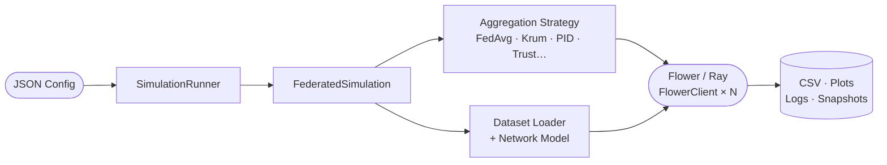

# InteFL

**InteFL** is a federated learning execution and research framework built on top of [Flower (flwr)](https://flower.ai/) and [Ray](https://www.ray.io/). It provides a complete pipeline for running FL simulations, experimenting with aggregation strategies, injecting adversarial attacks, and analysing results — all controllable through a JSON config file or a REST API.

---

## What it does

- **Multiple aggregation strategies** — FedAvg, Krum, Multi-Krum, Bulyan, RFA, Trimmed Mean, PID-based, Trust-based, ArKrum
- **Adversarial attack simulation** — label flipping, Gaussian noise, model/weight poisoning, token replacement; configurable per-round via `attack_schedule`
- **Rich dataset support** — FEMNIST, FLAIR, MedMNIST family, Lung Cancer, plus HuggingFace text datasets (financial, legal, medical)
- **CNN and transformer models** — standard CNNs per dataset, BERT fine-tuning with optional LoRA adapters
- **REST API + React UI** — launch and monitor simulations through a FastAPI backend and Vite/React dashboard
- **Celery task queue** — async simulation dispatch backed by Redis

---

## Quick links

| | |
|---|---|
| [Getting Started](getting-started.md) | Install and run your first simulation |
| [Architecture](architecture.md) | How the components fit together |
| [Configuration](configuration.md) | Full `StrategyConfig` field reference |
| [Datasets](datasets.md) | Supported datasets and keywords |
| [Strategies](strategies.md) | Available aggregation strategies |
| [Attacks](attacks.md) | Attack types and `attack_schedule` format |
| [API Reference](api.md) | REST endpoints |

---

## Technology stack

| Layer | Technology |
|---|---|
| FL orchestration | [Flower (flwr)](https://flower.ai/) |
| Distributed compute | [Ray](https://www.ray.io/) |
| Deep learning | [PyTorch](https://pytorch.org/) |
| LLM fine-tuning | [HuggingFace Transformers](https://huggingface.co/docs/transformers) + [PEFT/LoRA](https://huggingface.co/docs/peft) |
| Backend API | [FastAPI](https://fastapi.tiangolo.com/) + [Uvicorn](https://www.uvicorn.org/) |
| Task queue | [Celery](https://docs.celeryq.dev/) + Redis |
| Frontend | React + Vite |
