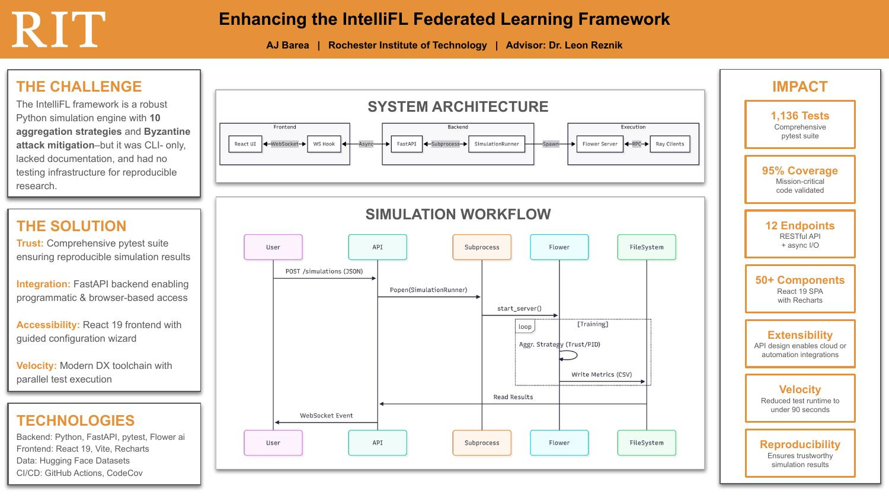

# Research

Publications, posters, and talks built around Phalanx-FL and its IntelliFL predecessor.

---

## [Enhancing the IntelliFL Federated Learning Framework](rit-capstone-2025-intellifl/index.md)

**Poster + final report** · Fall 2025 Graduate Capstone Poster Session (MS/SE & MS/DS), RIT GCCIS · Dec 10, 2025

MS capstone contribution to IntelliFL, a federated learning execution framework built on Flower. Focus areas: Ray-backed simulation stability on Windows, and the strategy / attack / defense / partitioning layer for FL experimentation.

[View artifacts →](rit-capstone-2025-intellifl/index.md)
